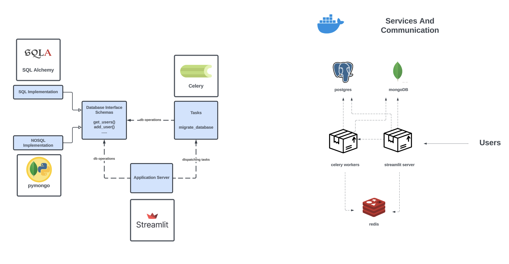

# IMSE


### Environment Variables
These are ready in Pycharm run configurations.

```shell
DB_TYPE=sql
CELERY_RESULT_BACKEND=redis://localhost:6379/0
CELERY_BROKER_URL=redis://localhost:6379/0
```

## Development
### Setup
Prerequisites

- python 3.11
- poetry
- docker
- postgresql (`brew install postgresql`)

Installation
```shell
poetry install
```

## Running

```shell
docker compose up
poetry run streamlit run ui/dashboard.py
```
Task queue is part of docker services, but can be run separately as well
```shell
poetry run celery --app backend.worker worker --loglevel INFO
```

## Architecture


### Tech Stack
- `SqlAlchemy` and `pymongo` libraries are used for database driver.
- `Streamlit` is used as the main user facing application. This library allows developers to create a reactive server in pure python. UI elements are defined in python files and generate html when the client connects, while the database connections are kept on server side.
- `Celery` - We would like to keep long-running processes independent of the user facing application server in order to have a more robust and reliable service. The database migration is dispatched as a celery task which will run independently of the application server. 


### Packages
#### backend
- Database operations and schemas
- celery tasks

#### ui
All the files in this package are ui components, and are rendered when the user visits the corresponding page (`dashboard.py` is the homepage, and `pages` folder has the rest of the website pages). Connections to the database and celery workers are handled in `server_connections`


### Deployment (docker-compose.yml Services)
following containers are part of the full deployment
- postgres
- mongo
- redis
- our package - entrypoint `celery backend/worker.py`  for running celery workers
- our package - entrypoint `streamlit ui/dashboard.py` for running the application


## TODO

### Issues
- cannot launch streamlit inside a container

### Tasks
- add environment variable for sqlite connection
- implement authentication (see how the db connection is handled in this case)
- use streamlit connection with the database and redis https://docs.streamlit.io/library/api-reference/connections/st.connections.sqlconnection

### Later/maybe
- track task progress https://pypi.org/project/celery-progress/

